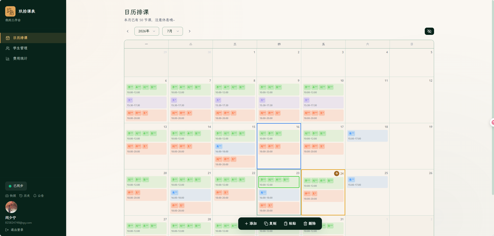
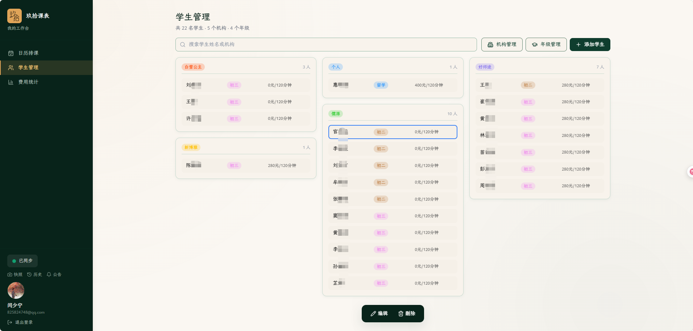
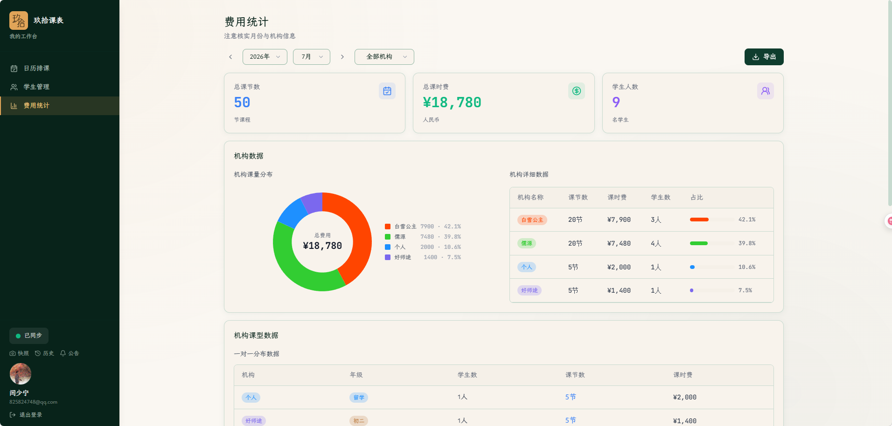

# 玖拾课表

<p align="center">
  
</p>

<p align="center"><strong>面向课外辅导教师的课程管理与统计系统</strong></p>

---

## 简介

玖拾课表是一款为课外辅导老师量身打造的课程管理工具，覆盖学生管理、日历排课、课时费统计等核心场景。支持多端访问，数据通过 Supabase 云端同步。

> [!IMPORTANT]
> 系统基于 Supabase 托管数据，因免费套餐性能有限，暂未开放自助注册。

> [!TIP]
> 您可自行部署后端服务，或联系作者开通账号。


---

## 在线访问

| 平台 | 地址 |
|------|------|
| **GitHub Pages** | [iamshaoning.github.io/jiushikebiao](https://iamshaoning.github.io/jiushikebiao) |

---

## 界面预览

<p align="center">
  
</p>

<p align="center">
  
</p>

<p align="center">
  
</p>

---

## 功能概览

### 日历排课

- **月历视图**：完整月历展示，每日课程一目了然
- **快捷排课**：点击任意日期即可添加课程，自动检测时间冲突
- **课程编辑**：支持对已有课程进行编辑、复制、粘贴、删除，操作前自动校验冲突与重复
- **月份导航**：左右箭头或年月下拉菜单快速跳转
- **节日调休**：内置中国农历节日及调休信息
- **多选操作**：日历单元格支持鼠标拖拽框选或 `Ctrl + 点击` 多选；课程标签支持 `Ctrl + 点击` 多选

### 学生管理

- **学生档案**：增删改查学生基本信息
- **快速检索**：按姓名或机构关键词搜索
- **布局切换**：支持单列表格 / 双列 / 三列卡片三种排列方式，按机构分组显示
- **机构管理**：自定义机构名称，支持增删改，可分配专属颜色标签
- **年级管理**：自定义年级名称，支持增删改，可分配专属颜色标签
- **默认费用**：预设一对一课时费，排课时自动带入
- **多选操作**：学生条目支持鼠标拖拽框选或 `Ctrl + 点击` 多选

### 费用统计

- **多维筛选**：按年份、月份、机构组合筛选
- **数据概览**：统计卡片直观呈现课时量、费用汇总等信息
- **报表导出**：一键导出 HTML 格式报表，便于存档与分享

### 体验优化

- **操作反馈**：全局通知提示 + 服务器连接状态指示器
- **开源字体**：采用霞鹜文楷（LXGW WenKai）开源中文字体
- **操作记录**：在本地保存有操作记录，可以单条撤销或者重做
- **快照系统**：在本地可自动和手动保存和恢复快照，防止数据意外变更

---

## 快速上手

### 1. 登录

打开系统，使用已注册账号登录，登录后数据自动从云端同步。

### 2. 配置基础数据

在「学生管理」页面依次完成：

1. **机构管理** — 添加机构（如「本部」「分校」）
2. **年级管理** — 添加年级（如「一年级」「初二」）

### 3. 添加学生

1. 进入「学生管理」页面，点击 **添加学生**
2. 填写姓名，选择所属机构与年级
3. 设置一对一课时预设费
4. 保存

### 4. 安排课程

1. 在日历视图中点击目标日期
2. 点击 **添加课程**
3. 选择课型（一对一 / 多人课）
4. 指定上课学生
5. 设置开始时间与时长
6. 多人课需手动填写课时费
7. 可按需添加备注
8. 保存

### 5. 查看统计

1. 进入「费用统计」页面
2. 选择年份与月份（支持按机构筛选）
3. 查看统计数据
4. 点击 **导出数据** 生成 HTML 报表

---

## 技术栈

- **前端框架**：React 18 + TypeScript，Vite 构建
- **状态管理**：Zustand
- **路由**：React Router（HashRouter，兼容 GitHub Pages 子路径）
- **样式方案**：TailwindCSS
- **虚拟滚动**：@tanstack/react-virtual（长列表性能优化）
- **后端服务**：Supabase（认证、PostgreSQL 数据库、实时数据同步）
- **部署平台**：GitHub Pages（GitHub Actions 自动构建部署）
- **开源字体**：霞鹜文楷（LXGW WenKai）
- **图标库**：Lucide React

---

## 本地开发

### 环境要求

- Node.js 20+
- npm

### 步骤

1. 克隆仓库

   ```bash
   git clone https://github.com/iamshaoning/jiushikebiao.git
   cd jiushikebiao
   ```

2. 安装依赖

   ```bash
   npm install
   ```

3. 配置环境变量

   复制 `.env.example` 为 `.env`，填入你的 Supabase 项目配置：

   ```env
   VITE_SUPABASE_URL=你的 Supabase 项目 URL
   VITE_SUPABASE_ANON_KEY=你的 Supabase anon key
   ```

4. 启动开发服务器

   ```bash
   npm run dev
   ```

5. 构建生产版本

   ```bash
   npm run build
   ```

> 部署到 GitHub Pages 时，需在仓库 `Settings → Secrets` 中配置 `VITE_SUPABASE_URL` 与 `VITE_SUPABASE_ANON_KEY`，GitHub Actions 会在构建时自动注入。

---

## 注意事项

- **网络依赖**：登录与数据同步功能需要网络连接
- **浏览器兼容**：推荐使用 Chrome、Firefox、Edge、Safari 等现代浏览器
- **账号安全**：妥善保管密码，避免在公共设备上保持登录状态
- **并发编辑**：尽量避免多端同时编辑数据，防止意外覆盖或丢失

---

## 联系方式

如有问题或建议，欢迎通过 [GitHub Issues](https://github.com/iamshaoning/jiushikebiao/issues) 反馈。

---

## 许可证

本项目可自由学习与使用，二次开发请注明出处。